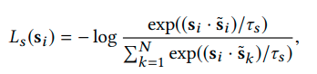
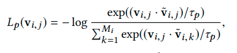
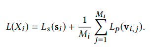
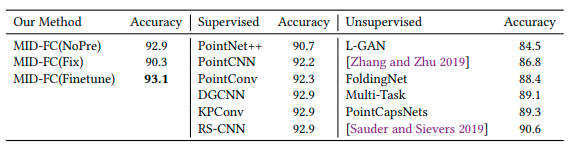
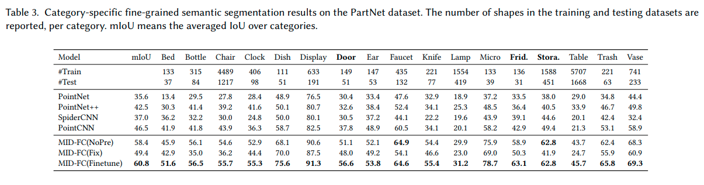
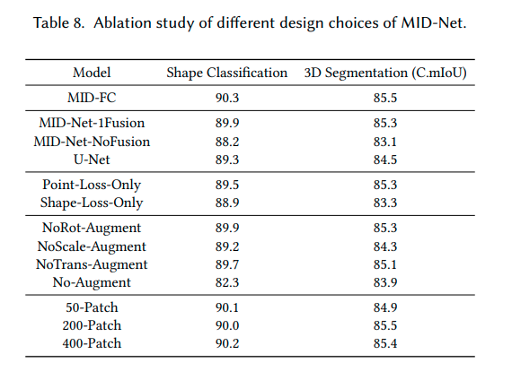

We propose an unsupervised method for learning a generic and efficient shape encoding network for different shape analysis tasks

The key idea of our method is to **jointly encode and learn shape and point features from unlabeled 3D point clouds**.

We **adapt HR-Net** to octree-based convolutional neural networks **and design a** simple-yet-efficient Multiresolution Instance Discrimination (MID) **loss** for jointly learning the shape and point features.

input: 3D point cloud
output: shape and point features

After training, the network is concatenated with simple task-specific backend layers and fine-tuned for different shape analysis tasks.

note:
Unsupervised pre-training methods first learn a feature extraction backbone network from an unlabeled dataset via carefully designed unsupervised pretext task losses. After that, the pre-trained backbone network is concatenated with task-specific back-end networks and refined for different downstream tasks via transfer learning.

note:
Our key observation is that a 3D shape is composed of its local parts and thus the feature for shape and points are coherent and should be encoded and trained jointly

idea:
**a shape instance discrimination loss classifies augmented copies of each shape instance of a 3D dataset in one class**, while **a point instance discrimination loss classifies the same points on the augmented copies of a shape instance in a class.**

**we first exploit the shape instance discrimination loss to classify the point of each shape into a class and then apply the point instance discrimination to classify the points on each shape separately**

we train backbone shape encoding network (MIDNet) with ShapeNetCore55

note:
Although existing works can generate both point-level and shape-level features, their pretext tasks do not impose explicit selfsupervision on both levels. We fill this gap by discriminating differentlevel shape features simultaneously and achieve significant improvements.

#### Unsupervised feature learning via multiresolution instance discrimination

given: 
unlabeled 3D shape collection of N models
each model Xi consisting of Mi points
(j-th point of Xi = pij)

result:
train an encoder that generates representative shape features (si) and point-wise features (vij) for that collection

basically we use MID task to self-supervise the learning process

##### Input processing
1. We pre-process the point cloud to assign a normal vector for each point via principal component analysis if the accurate normal information is not available in the dataset, which will be used for constructing input features.
2. we first normalize each point cloud into a unit sphere, 
3. then generate shape instances with a transformation composed by random rotations, random translations within [-0.25, 0.25], and random scaling along each coordinate axis with the ratio within [0.75,1.25] (The small number of points outside the unit sphere after transformations is truncated.)
4. MultiResolution instance class creation:
    -   We label the transformed instances of the same shape with its index in the input dataset. 
    -   Also, each point on the generated instance is labeled by the same index of the corresponding point in the input shape in the dataset
    -   (note that these labels are unsupervised)
5. to reduce memory:
   -    On each shape Xi in the dataset, we over-segment it into Ki patches (Ki ≪ Mi) thus we crreate Ki patch-instance classes instead of Mi point-instance classes
   -    For simplicity, we use the K-Means algorithm to compute over-segmented patches and choose the same K for all the shapes, K=100
   
#### Network Design

-   A 3D point cloud is first converted to an octree representation, by default, in 64^3 resolution.
-  For each non-empty octant at the finest level, we fit a plane to the points inside it, where the plane normal is fixed to the average normal of these points. **We take the unit normal of the plane and the plane offset to the octant center as the raw feature vector**. To deal with the possible inconsistent normal orientation issue across the shape, **we convert each normal component to its absolute value**, and find this trick does not hurt network performance.
-  **the high-to-low resolution subnetworks are gradually added one by one and the second-highest resolution subnetwork is always kept**
- The features extracted from each subnetwork are downsampled and fed into low-resolution networks, and they are also upsampled and fed into the high-resolution subnetwork
- **For point-wise features, we interpolate the high-resolution features defined at the second finest-level octants according to the point position via tri-linear interpolation.**
- **Note that the high-resolution features at each octant are also the concatenation of features obtained from the high-resolution network and the upsampled feature from the low-resolution subnetwork.**
- note: ResBlock(3) represents three cascaded ResNet blocks with a bottleneck structure
-  The Downsample operation is implemented by max-pooling, and the Upsample operation is simply tri-linear up-sampling.

#### Shape instance discrimination loss:

cross entropy loss for i-th class:

To obtain a good classification, an optimal s˜i expects to be the average center of features of all shape instances in this class.
Meanwhile this loss maximizes the distance between si and other s˜k (k != i), which makes the shape feature si of shape Xi  discriminative against the features of other 3D models.

#### Point instance discrimination loss:
cross entropy loss for points in the j-th point class:

note: we use K patches instead of M points

#### MID loss:

#### Training:
TODO : see
1. randomly sample a mini-batch {Xb} with b=1..B
2. compute MID loss
3. update encoder weights with SGD from MID loss
4. update {si} and {v_ic} with:
    - s˜i = (1 − λs ) · s˜i + λs · si
    - v˜i,c = (1 − λp ) · v˜i,c + λp · vi,c ,
    where λs and λp are momentum parameters set to 0.5
    
    
details:
- ShapeNetCore55 (f 57,449 3D shapes)
- batch 32
- momentum 0.9
- weight decay 0.0005
- init lr 0.03 ,decay by facto 10 after 200 and 300 epochs
- total 400 epochs (40 hours on 2080Ti)
- 1.5M parameters

#### Feature visualization
T-SNE

#### Experiments

1. MID-FC(Fix)
    - we fix the pre-trained MID-Net and only train the back-end with the labeled training data in each shape analysis task (classification and segmentation).

2. MID-FC(Finetune)
    - we fine-tune both MID-Net and the FC back-end with the labeled training data in each shape analysis task. The MID-Net is initialized with the pre-trained weights, and the FC back-end is randomly initialized

our method first constructs the octree of input 3D point cloud and compute input features of the finest-level octants with the same process used in MID-Net pre-training. Then the MID-Net computes the shape and point features of 3D input, **where the feature of each point is computed from the output features of nearby eight leave octants via tri-linear interpolation.** After that, the output **shape or point** features are fed into the following back end layers for computing the shape analysis results.

3. MID-FC(NoPre)
    - train the concatenated networks in a supervised way. In particular, we initialize both MID-Net and FC layers with random initialization and train the network from scratch with the labeled training data of each shape analysis task.

#### Classification

details:
- 240epochs
- batch 32
- initial lr 0.1 for MID-FC(NoPre) and MID-FC(Fix), 0.01 for MID-FC(Finetune)
- The learning rate decays by a factor of 1/10 after 120 and 180 epochs

#### Part segmentation

- mean IOU across all 17 categories
- ShapeNet dataset used for pre-training

- batch size 32. 
- The learning rate of MID-FC(Fix) and MID-FC(NoPre) starts from 10−1 and decreases to 10−3, and the learning rate of MID-FC(Finetune) decays from 10−2 to 10−4

here you see unet performance is less and using only shape loss or point loss gives also less performance than using mid loss

