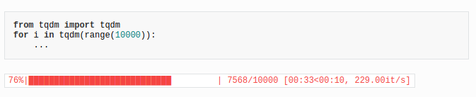

Useful functions:

- use tqdm library!!
    
    ```
    for i in tqdm(range(start_iter, max_iter + 1), ncols=80): ...
    ```

```python
import tensorflow as tf
tf.train.piecewise_constant(...)
```

```python
from yacs.config import CfgNode as CN
FLAGS = CN()
...
def _update_config(FLAGS, args):
  FLAGS.defrost()
  if args.config:
    FLAGS.merge_from_file(args.config)
  if args.opts:
    FLAGS.merge_from_list(args.opts)
  FLAGS.SYS.cmds = ' '.join(sys.argv)
  FLAGS.freeze()
```

```python
import shutil
shutil.copy2(args.config, logdir)
```
    
```python
eval('self.{}()'.format(self.flags.run))
```

```python
# __init__ vs __call__

class Foo:
    def __init__(self, a, b, c):
        pass
    def __call__(self, a, b, c):
        pass

x = Foo(1, 2, 3) # calls __init__
x(4, 5, 6) # calls __call__
```

- in the code he is passing a lot of functions around as arguments, and the functions he is passing is many times the `__call__` of a class !!!

```python
tf.variable_scope(scope_name, reuse)
# reuse set to 
# None: means this tf.variable_scope() inherits parent variable scope reuse mode
# True: makes this variable scope and sub scopes to a reuse mode if sub scopes have set reuse = None.
# tf.AUTO_REUSE: it will create variables if they do not exist, and return them otherwise.

# When we use tf.variable_scope(), we should use tf.get_variable() function to create or return an existing variable. If you use tf.Variable(), it will create a new variable no matter what value the reuse parameter is.

# Note: tf.get_variable() can create a new tensorflow only if reuse = None or tf.AUTO_REUSE. if reuse = True, tf.get_variable() can only return an existing variable created by tf.get_variable(); it can not create a new one.

# so basically we can have two python variables that point to the same tensroflow variable!! :
def layer_weight():
    with tf.variable_scope("weight", reuse = tf.AUTO_REUSE):
        w = tf.get_variable(name = 'w',initializer = tf.random_normal(shape=[2,2], mean=0, stddev=1))
    return w
w1 = layer_weight()
w2 = layer_weight()
# w1 is same as w2
```

```python
tf.layers.batch_normalization(conv, axis=1, training=training)
# can be used instead of manually generating moving averages and update ops ...
```

```python
# for testing tensorflow:

class Octree2ColTest(tf.test.TestCase):
    ...
    def test_forward(self):
        with self.cached_session():     
            ...
```
   
- also in tests:
    -   tf.test.compute_gradient(..) to compute theoretical and numerical jacobian gradients !!
    -   self.assertAllClose() to assert that each number of arrays differs from its equivalent no more than a small number !!
    

- run() and eval():
    - op.run() is a shortcut for calling tf.get_default_session().run(op)
    - t.eval() is a shortcut for calling tf.get_default_session().run(t)
    - The difference is in Operations vs. Tensors. Operations use run() and Tensors use eval().
    - basically these are equivalent:
    ```python
    # Using `Session.run()`.
    sess = tf.Session()
    c = tf.constant(5.0)
    print(sess.run(c))
    
    # Using `Tensor.eval()`.
    c = tf.constant(5.0)
    with tf.Session():
      print(c.eval())
    ```

- tensor vs operation:
    - A tensor represents a rectangular array of data.
    - An operation represents a graph node that performs computation on tensors.
    
```python
tf.data.TFRecordDataset('path').take(-1)
# with -1 we take all samples of dataset
```

- Most dataset input pipelines should end with a call to prefetch. This allows later elements to be prepared while the current element is being processed. This often improves latency and throughput, at the cost of using additional memory to store prefetched elements.
    ```python
    tf.DataSet()...prefetch()    
    ``` 
 
### tests

in test_octree_conv, test_octree_search and in test_octree_gather the self.assert... woould just fail if fail otherwise it doesnt say it's success so i added in the class 
```
  def setUp(self):
    self.verificationErrors = []

  def tearDown(self):
    self.assertEqual([], self.verificationErrors)
```
and replaced every self.assert.. with:
```
  try:
    self.assert...
  except AssertionError as e:
    self.verificationErrors.append(str(e))
```
to make sure is success

 
### run_cls.py:

first call graph with train and reuse=false:
with tf.variable_scope("ocnn", reuse=False)
    
    variable data:
        transform shape into [1, 3(channels), -1, 1] where i guess -1 is for the depth ? or for the length of arrays containing octant info?
        
    loop for depths [max_depth,...,2]

### Questions
- is 'test' scope because in 'train' scope he does anyway a split of train+validation ?

- octree_conv_memory and octree_conv_fast ... i dont understand them 

- sto build_train_graph giati train_tensors reuse = false kai test_tensors reuse = true ? na do ta functions apo kato tous ti xrisimopoioun..

- to summaries pos to kanei ?

- sto test_octree2col:
    - to data_in pou exei shape 1,3,8,1 einai diladi 1 sample, 3 channels, 8 features tou octree(octant) ? 
    - to idx_maps ti einai ?
    - to vi ti einai ?
    - to kernel_size pou einai 3 kathe fora diladi [num_filters, wifht, height] or something else?
    - pos douleuei to octree2col ? examples:
        - input (1,3,8,1), kernel [3,3,3], stride 1, output (3,27,8)
        - input (1,3,8,1), kernel [2,2,2], stride 1, output (3,8,8)
        - input (1,3,8,1), kernel [3,1,1], stride 1, output (3,3,8)
        - input (1,3,8,1), kernel [3,3,1], stride 1, output (3,9,8)
        - input (1,3,8,1), kernel [3,3,3], stride 2, output (3,27,1)
        - input (1,3,8,1), kernel [2,2,2], stride 2, output (3,8,1)

- giati data shape [1, 3 (channels), 152, 1] ?? giati using only height ? 


 - test_octree_deconv will raise exception ..


- what is octree_search doing ? 
- what is octree_property(property_name='index') and octree_property(property_name='xyz') doing?


- octree_batch(octree_samples(['octree_1', 'octree_2'])) this probably concatenates the two different octrees into one super-octree as explained in paper

- what is the 'split_label' ?

- is there a run mode where both train graph and test graph are created?


** probably they use two graphs, one with train and one with test because:
1. in train they want to support multi gpu thus reuse=True is useful
2. using TFRecordDataset its easy to make one dataset reading training data and one reading input data and then just pass them as inputs .. instead of feeding training data and then switching dataset to read test...


note: to check processes that run python: ps aux | grep python
also use: psensor to check temperatures


"The correct way to feed data into your models is to use an input pipeline to ensure that the GPU has never to wait for new stuff to come in. i.e. not use feed_dict"

so use:
```python
iter = dataset.make_initializable_iterator()
features, labels = iter.get_next()
net = tf.layers.dense(features, 8, activation=tf.tanh)
```

**https://github.com/tensorflow/tensorflow/issues/19933
so:
1st method:
```python
dataset = tf.data.TFRecordDataset(data_file)
dataset = dataset.prefetch(buffer_size=batch_size*10)
dataset = dataset.map(parse_tfrecord, num_parallel_calls=5)
dataset = dataset.repeat(num_epochs)
dataset = dataset.batch(batch_size)

features, labels = dataset.make_one_shot_iterator().get_next()    
logits = tf.feature_column.linear_model(features=features, feature_columns=columns, cols_to_vars=cols_to_vars)
train_op = ...

with tf.Session() as sess:
    sess.run(train_op)
```
2nd method:
```python
example = tf.placeholder(dtype=tf.string, shape=[None])
features = tf.parse_example(example, features=tf.feature_column.make_parse_example_spec(columns+[tf.feature_column.numeric_column('label', dtype=tf.float32, default_value=0)]))
labels = features.pop('label')
train_op = ...

dataset = tf.data.TFRecordDataset(data_file).repeat().batch(batch_size)
next_batch = dataset.make_one_shot_iterator().get_next()

with tf.Session() as sess:
    data_batch = sess.run(next_batch)
    sess.run(train_op, feed_dict={example: data_batch})
```

basically in the 1st method inputs are not placeholders .. they are directly tensors with data..